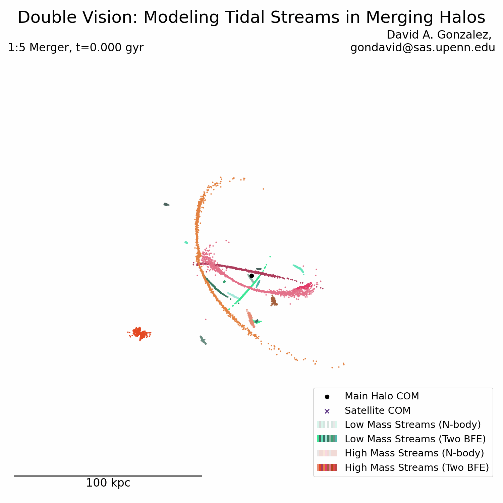
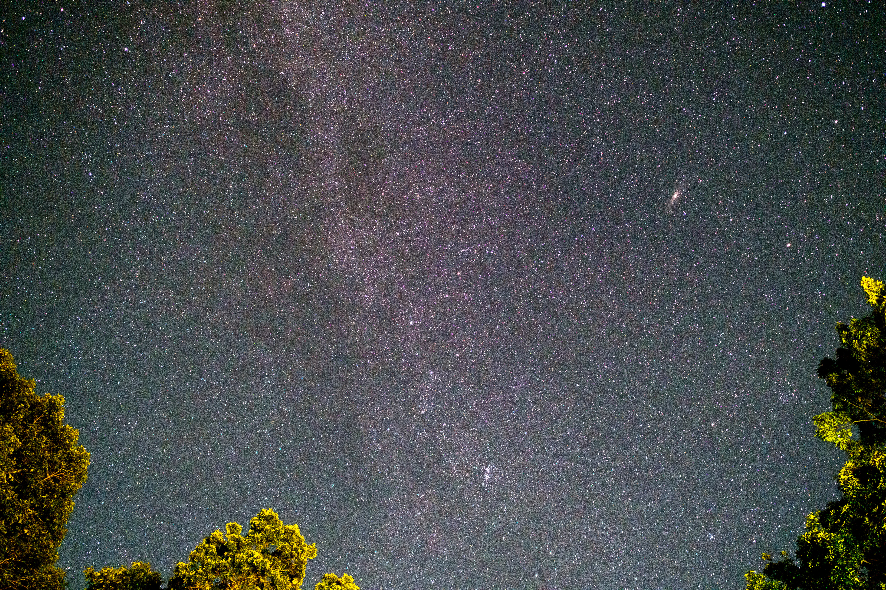
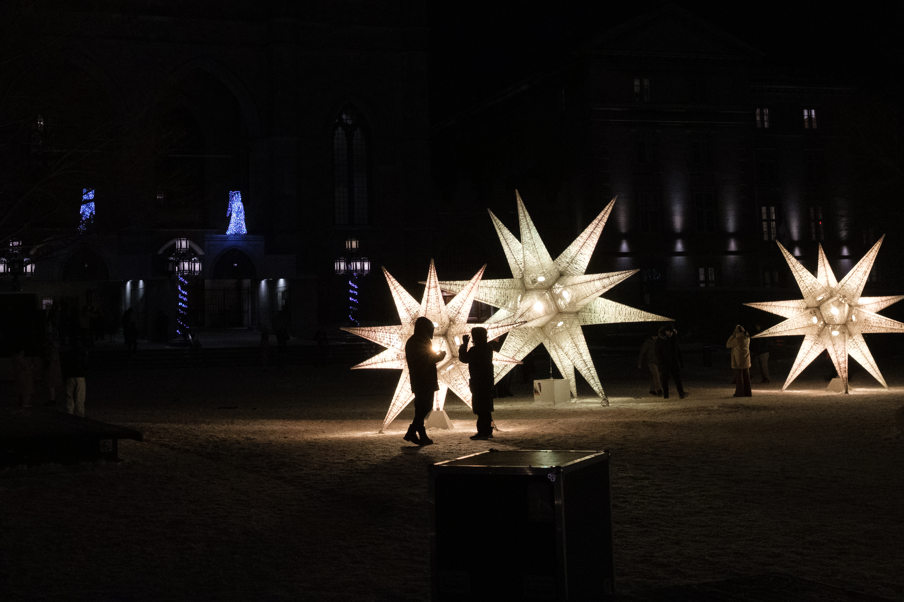

## Hello! I'm David!

I'm a third year PhD Student at the University of Pennsylvania. I primarily study stellar streams, but am also interested in merger events. I have primarily worked on simulations, but would like to work more with pairing these sims to real observables.

🔭 I'm currently working on quantifying the success of BFEs in reproducing streams in mergers, as well as studying the impacts of binaries on stream width observations.

📫 _How to reach me_
  * **Email**: gondavid@sas.upenn.edu
  * **Email**: davidamirgonzalez@gmail.com

---

### 📷 Photography — I also like astro and street photography!
<!-- PHOTOS:START -->

<!-- PHOTOS:END -->

<!--

  
  

--!>
