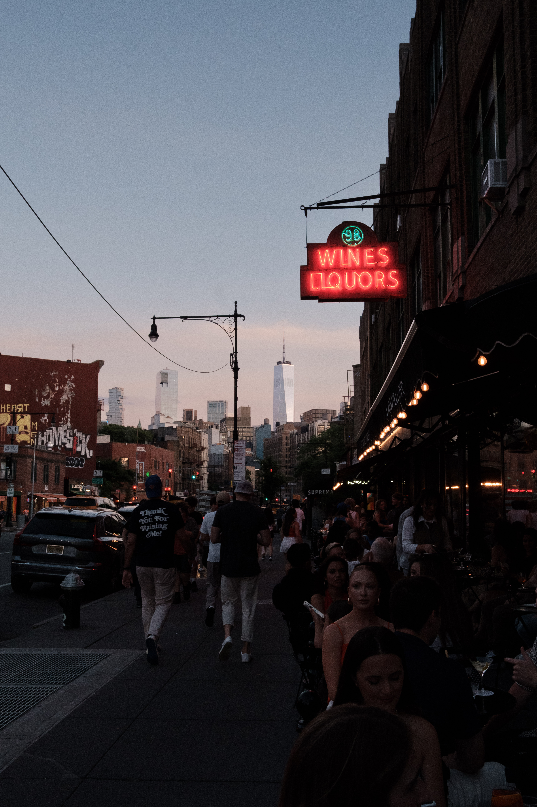

## Hello! I'm David!

I'm a third year PhD Student at the University of Pennsylvania. I primarily study stellar streams, but am also interested in merger events. I have primarily worked on simulations, but would like to work more with pairing these sims to real observables.

🔭 I’m currently working on quantifying the success of BFEs in reproducing streams in mergers, as well as studying the impacts of binaries on stream width observations

<!--  !-->

## I also like photography! Both astro and street!

📫 _How to reach me_
  * **Email**: gondavid@sas.upenn.edu
<!--

- 😄 Pronouns: ...

Here are some ideas to get you started:

- 🔭 I’m currently working on ...
- 🌱 I’m currently learning ...
- 👯 I’m looking to collaborate on ...
- 🤔 I’m looking for help with ...
- 💬 Ask me about ...

--!>
